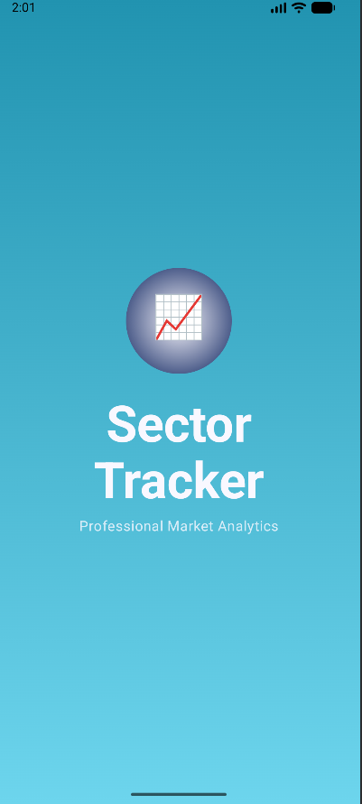
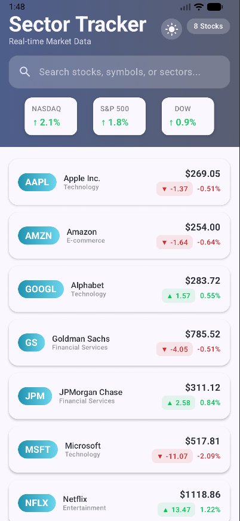
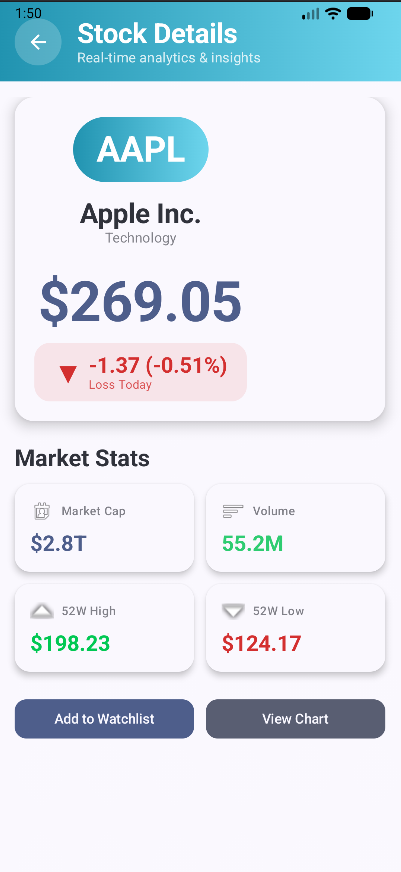
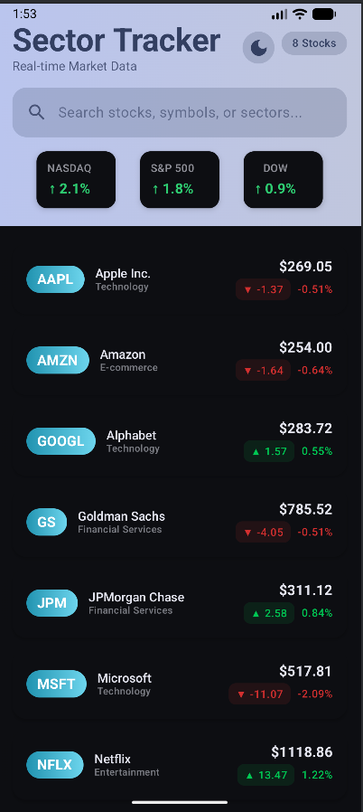

# 📈 Sector Tracker - Professional Stock Market Analytics App

## 🎥 Demo Screenshots

| Splash Screen | Home Screen | Details Screen | Dark Mode |
|:-------------:|:-----------:|:--------------:|:---------:|
|  |  |  |  |

## ✨ Features

### 📊 Real-time Stock Data
- Live stock prices from Marketstack API
- Daily change percentage with color-coded indicators
- Professional stock analytics dashboard

### 🎨 Modern UI/UX
- **Jetpack Compose** for declarative UI
- **Material Design 3** with dynamic colors
- **Dark/Light mode** toggle with persistence
- **Smooth animations** and transitions
- **Professional gradient designs**

### 🔍 Advanced Functionality
- **Search** stocks by symbol, company, or sector
- **Pull-to-refresh** for latest data
- **Offline support** with Room database caching
- **Detailed analytics** for each stock
- **Market statistics** and sector tracking

## 🛠️ Tech Stack
- **Language**: Kotlin 100%
- **UI Framework**: Jetpack Compose
- **Architecture**: MVVM + MVI
- **Local Database**: Room
- **Networking**: Retrofit + Coroutines
- **Testing**: JUnit, Coroutines Test

## 🚀 Getting Started
1. Clone the repository
2. Open in Android Studio
3. Add your Marketstack API Key
4. Build and run

## 👨‍💻 Author
**Tanaka Zvakaramba**
- GitHub: [@Tanakazvaks](https://github.com/Tanakazvaks)
- LinkedIn: [Tanaka Zvakaramba](https://www.linkedin.com/in/tanaka-zvakaramba-626a36211)

## 📄 License
MIT License
